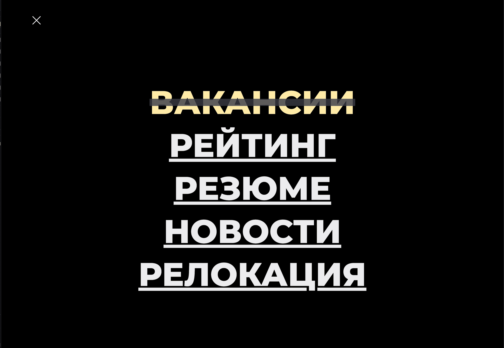
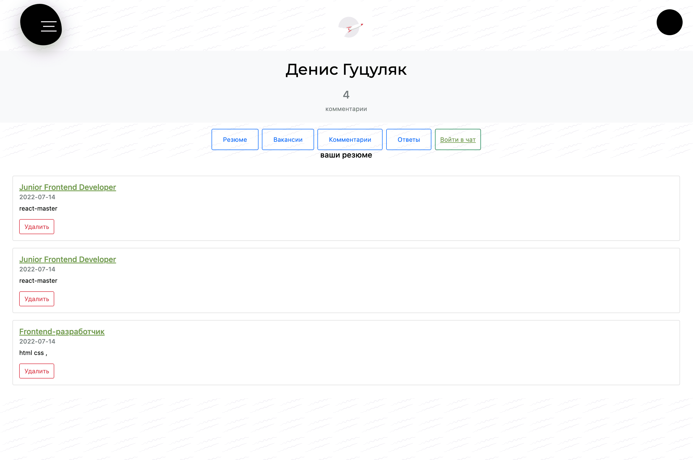
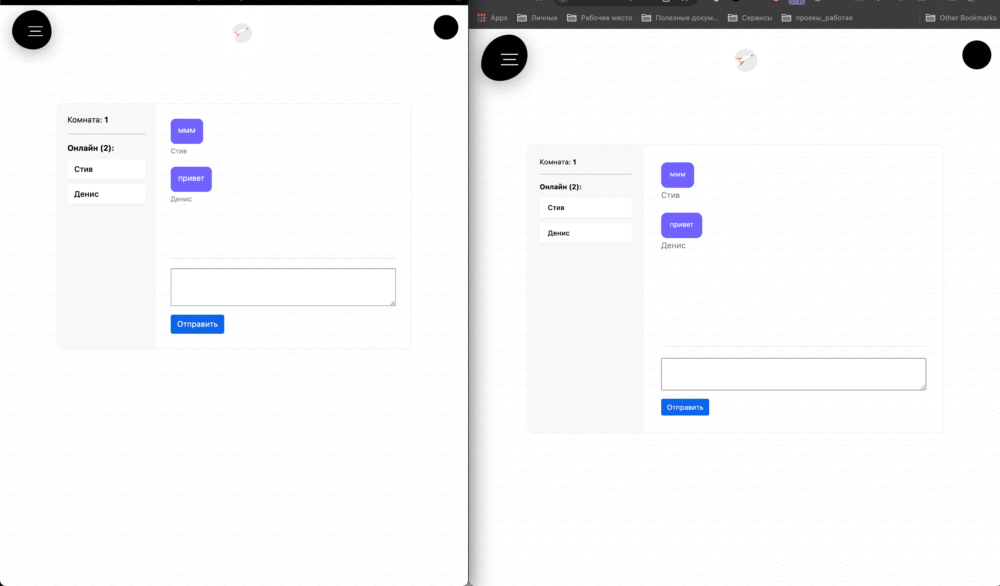

# Launch

**Launch** - is the idea of several IT-guys to create a service for those who start their career in IT.

We present you a service where IT interns and juniors can post their CVs or vice versa IT HRs can post vacancies to find fresh brains (to develop, not to eat ha-ha)
for their team.

In addition we added comments section so 'newborn' programmers can upgrade their data and skills. They can communicate with fellow coders to enhance their CVs
or even conduct test interviews. This can be done also through chat section.

Though Launch is primarily aimed at russian-speakers it also contains section with vacancies abroad to relocate.

There is also news for programmers to be up to date with the current events.

This is our final project for Moscow Elbrus Bootcamp. Please enjoy it.

## Team:
<br/>
Nikita Artamonov - Teamlead/Fullstack
<br/>
Denis Gutsulyak - Fullstack
<br/>
Evgeniy Tabunov - Frontend
<br/>
Vladislav Rudnitskiy - Frontend
<br/>
Roman Kulikov - Fullstack

## launch menu navigation
<br/>
  
<br/>

## launch profile user.

<br/>
  
<br/>

## socket.io


## Getting Started
``` bash
cd socket && npm i & cd ../server && npm i & cd ../client && npm i & cd ..


// start server
cd socket && npm start & cd ../server && npm run dev & cd ../client && npm run start & cd ..


login: admin@admin.ru
//or
login:d.991@mail.ru
password: 1234qwer

```